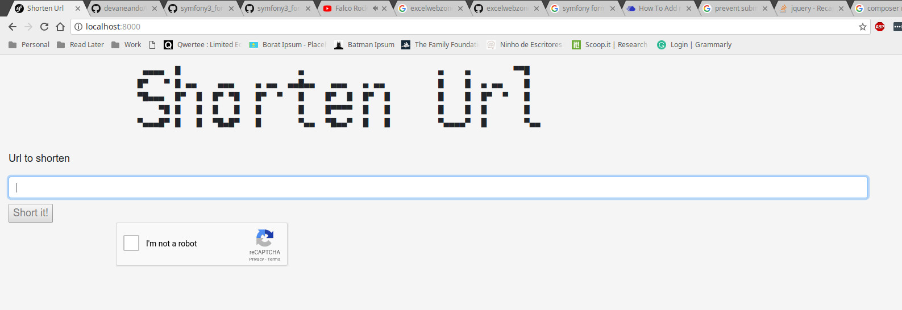

# urlShortener

A simple url shortener made in Symfony



## Install

Create the database

```sql
CREATE DATABASE url_sortener CHARACTER SET utf8 COLLATE utf8_genral_ci;
CREATE USER 'url_admin'@'localhost' IDENTIFIED BY '12345678';
GRANT ALL PRIVILEGES ON url_sortener.* TO 'url_admin'@'localhost';
FLUSH PRIVILEGES;
```

Fill the data in the `app/config/parameters.yml` file:

```yaml
parameters:
    database_host: 127.0.0.1
    database_port: null
    database_name: url_sortener
    database_user: url_admin
    database_password: 12345678
```

Update the schema

```bash
bin/console doctrine:schema:update --force
```

## Usage

Start the development web server

```bash
bin/console server:start
```

Open the <http://localhost:8000/> in your browser

Paste the url you want to shorten in `Url to shorten` field. You will get a link to the shortened URL.

To open the shortened URL, use <http://localhost:8000/{hash}>
